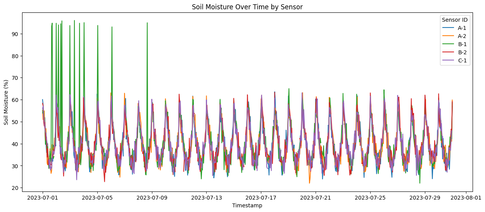

# Lab 05: Answer Sheet

## Question 1: How many rows were generated? How many were expected? Why?

**Answer:** 
1) 3606 rows,
2) 3605 rows, 
3) 30 days * 24 hours(From Day 1 00:00 to Day 2 23:00) * 5 kinds= 3600, 
3600 + 5*1 =3605(The 2023-07-31 00:00 for every kind of plant will be include)
3605 + 1= 3606 (The label of timestamp,sensor_id,plant_type,location,temperature_c,soil_moisture,light_level,pump_active)
---

## Question 2: What appears to be the unit of temperature, soil_moisture, and light_level?

**Answer:**
T,%,lx
---

## Question 3: What is the difference between the mean and median moisture reading? Given the system's purpose, why might you expect these values to differ?

**Answer:** 
Mean: 39.65007956805911
Median: 37.8

The mean is the sum of all values in a data set divided by the total number of values (the average), while the median is the middle value when the data set is arranged in order from smallest to largest.

The increasing trend of higher half of the value is bigger than than the lower part. 
---

## Question 4: After converting the timestamp column, what methods are now available on df['timestamp'].dt?

**Answer:**
1) access the member of the time ,e.g. year, day.
2) Transform the date to the information

dt.year、dt.month、dt.day、dt.hour、dt.minute、dt.second、dt.microsecond、dt.nanosecond、dt.week、dt.dayofweek、dt.dayofyear、dt.quarter、dt.is_month_start、dt.is_month_end、dt.is_quarter_start、dt.is_quarter_end、dt.is_year_start、dt.is_year_end、dt.is_leap_year、dt.is_normalized、dt.tz

dt.weekday()、dt.isoweekday()、dt.day_name()、dt.month_name()
dt.floor()、dt.ceil()、dt.round()、dt.to_period()、dt.to_pydatetime()
dt.strftime()、dt.isoformat()
dt.nunique()、dt.value_counts()、dt.max()、dt.min()
---

## Question 5: Justify the reason behind your choice.

**Answer:**
we use fillna() to use the mean of day to fill the empty.
Reason:
1) Actually use the interpolate("linear") is also fine because it reveal the trend from the front and back of the empty, but if the the front or back of empty is all nan, the function can't fill the empty.
2) Using the mean of the day which the empty belonged to can maintain the accurary of the mean value with a little error from the actual value.
3) Mositure can be changed instantly, so the mean value is better than the linear trend.
---

## Question 6: Which sensor is in the driest environment on average? Which plant type requires the most water?

**Answer:**
B-2,
Monstera
---

## Question 7: Looking at your line plot, describe the daily pattern of soil moisture. What does it tell you about the environment and the watering system?

**Answer:**
1) The system will largen the moisture to the highest in the begin of a day/00:00 AM.
2) After the initial rise, the moisture will keep going down until the moisture is closed to 30%
3) Once the moisture is touch the 30% base, the system will maintain mositure around 30% until a new day.

---

## Question 8: What does the histogram tell you about the temperature environment? Based on the scatter plot, what is the general relationship between temperature and soil moisture?

**Answer:**

**Histogram Analysis:**
1) Temperature  is around (13,26.5)
2) If we divide the whole temperature interval into three parts, then the occupying frequency of high temperature and low temperature is nearly equal, and is higher than middle interval.
3) But the occupying frequency of extreme temperature(highest in high temperature and lowest temperature) in the high or low temperature is very low.
**Scatter Plot Analysis:**
1) General: The temprature has a inverse linear relation with moisture, with the tempature increasing, moisture down.
2) unusual pattern:Some points deviate the most point with high moisture.
---

## Final Challenge: 

**Visualizations**

**A short paragraph justifying which sensor you believe is faulty**
Sensor B_1 is faulty, because in the period from 2023-07-01 to 2023-07-08, it has a biggest gap between max moisture value and min moisture value.
